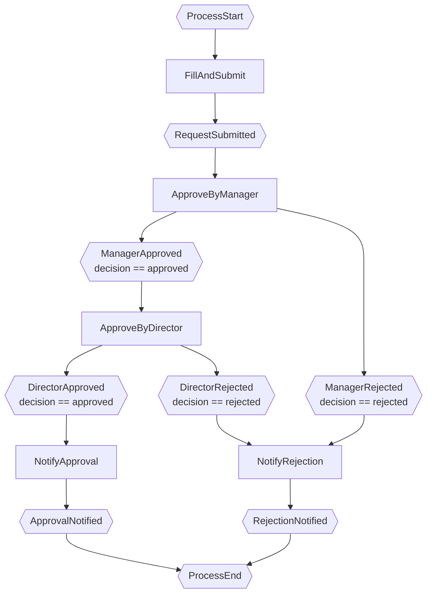
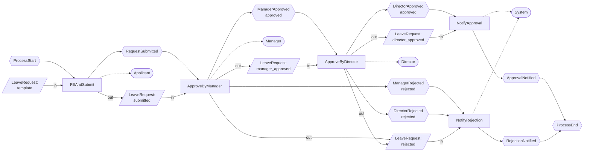

# EPC2 Diagram: Leave Request Approval

## Workflow Viewpoint (Mermaid)

## Full EPC2 (Workflow + Docflow + Roles)

## Notes on EPC2 Rules Applied

1. **No explicit AND/OR/XOR gateways** — the conditions live inside the event hexagons.
2. **XOR-split** at `ApproveByManager`: `ManagerApproved` and `ManagerRejected` are mutually exclusive (decision can only be 'approved' OR 'rejected').
3. **XOR-split** at `ApproveByDirector`: same pattern.
4. **Document flows** appear on the **west (left) side** of each function as parallelograms connected with labeled arrows.
5. **Roles** appear on the **east (right) side** of each function with dashed association lines.
6. Both `NotifyApproval` and `NotifyRejection` converge to the same `ProcessEnd` — implicit XOR-join (only one path fires per instance).
